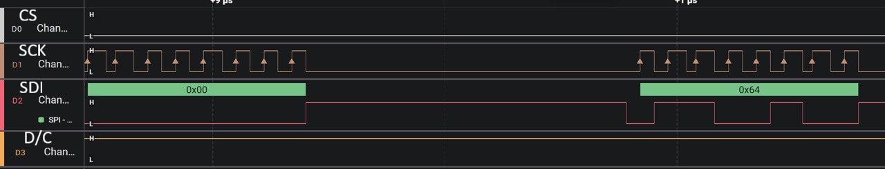

[](https://classroom.github.com/a/niGavbkL)

# lab4-pong

    * Name: Aktilek Skakova
    * Github username:f25-lab4-t21
    * Github Repository URL:https://github.com/upenn-embedded/lab4-f25-pong-f25-lab4-t21
    * Description of hardware: (embedded hardware, laptop, etc): Laptop

**Part A: LCD Graphics Library**

**(R1)**

The ST7735 LCD controller distinguishes between command and data packets using a dedicated **Data/Command (D/C)** control line. When this line is set  **low (D/C = 0)** , the bytes sent through the SPI interface are interpreted as commands that configure the display, such as setting column or row addresses. When the line is set  **high (D/C = 1)** , the transmitted bytes are treated as data, such as pixel color values to be drawn on the screen. This separation allows the controller to interpret incoming information correctly without confusion between configuration instructions and graphical content.

**(R2)**

Although each pixel color in the ST7735 display is represented as a  16-bit RGB565 value , the SPI communication protocol transmits data in  8-bit bytes . Therefore, each color is divided into two bytes before transmission. The most significant byte (MSB) is sent first, followed by the  least significant byte (LSB) . For example, a color value of 0xf8 (which represents pure red) is transmitted as two separate bytes: 0xF8 and 0x00. The controller then recombines these two bytes internally to reconstruct the 16-bit color value for that pixel.

**(R3)**

The LCD_setAddr function defines a drawing window or “address window” on the screen. This function sets the specific area—bounded by start and end coordinates—where pixel data will be written. It achieves this by sending column address (CASET) and row address (RASET) commands to the LCD controller, effectively selecting a rectangular region. After setting this region, any pixel data sent will fill only that defined area. This approach significantly improves efficiency when drawing shapes, images, or text because it eliminates the need to specify individual pixel coordinates for each data point.

**(R4)**

A 24-bit RGB color format allocates 8 bits to each color channel—red, green, and blue—allowing for 16.7 million color combinations. In contrast, the 16-bit RGB565 format uses 5 bits for red, 6 bits for green, and 5 bits for blue, reducing the total number of colors to 65,536. This compression slightly reduces color precision, particularly in the red and blue channels. However, the loss of information is generally not visually significant to the human eye. The trade-off provides major advantages in performance: it reduces data size, speeds up SPI transfer, and saves memory while maintaining sufficient image quality for embedded displays.

**(C1)** LCD_GFX.c and LCD_GFX.h were updated..

**(R5)**

The Clock (SCK) pin provides the timing reference for SPI communication between the MCU and the LCD. Every bit of data sent or received is synchronized with the rising or falling edge of this clock signal. The microcontroller generates the clock pulses, and the LCD reads incoming data according to this timing. Therefore, the clock signal always flows from the MCU to the LCD, ensuring that both devices stay synchronized during data transfer.

The Chip Select (CS) pin determines when the LCD is actively communicating with the MCU. When the CS pin is pulled low, the LCD becomes active and listens for SPI commands or data. When the CS pin is high, the LCD ignores all SPI traffic. This mechanism allows multiple SPI devices to share the same bus without interfering with each other. The control of this line originates from the MCU to the LCD.

The Serial Data In (SDI) or MOSI (Master Out, Slave In) line transmits the actual data from the MCU to the LCD screen. This includes both commands and pixel color data, depending on the state of the D/C pin. Each bit is shifted out from the MCU and read by the LCD in synchronization with the clock pulses. Data on this line flows strictly from the MCU to the LCD, as the LCD acts only as a receiver in this SPI configuration.

The Data/Command (D/C) pin tells the LCD how to interpret the incoming SPI bytes. When the D/C pin is set low, the bytes received are interpreted as commands that configure the display (e.g., setting address ranges, orientation, or display mode). When the pin is high, the bytes are treated as data, such as pixel values to draw on the screen. This control signal travels from the MCU to the LCD, allowing the display controller to properly distinguish between setup instructions and visual content.

S1)



**(R6)**

The SDI (Serial Data In) signal is synchronized with the SCK (Serial Clock) signal during SPI communication. Each bit of data transmitted on SDI corresponds to one clock pulse on SCK. The MCU outputs the clock pulses, and data on SDI changes state shortly before each rising edge of SCK so that it can be sampled reliably by the LCD. This ensures proper timing and stable data transfer. The observed behavior confirms the expected SPI protocol operation, where data transmission and clock synchronization occur in a coordinated manner.

**(R7)**

During the SPI transaction, the Chip Select (CS) line is pulled low for the duration of the active data transfer between the MCU and the LCD. While CS is low, the LCD is enabled to receive data, and each byte is transmitted over eight clock cycles on the SDI line. The CS line remains low long enough for one full byte of data to be clocked in before returning high to indicate the end of the transaction. In this process, one byte of data is transmitted for each CS-low interval, corresponding to eight bits synchronized with the clock pulses on the SCK line. This behavior confirms the expected SPI protocol timing, where CS defines the frame boundary for each byte transmitted.

**Part B: Pong**

T1) The game was demonstrated to Guanlin

**Part E: Wireless Control of Pong**

**(R8)**

Debouncing is not required in this setup because the paddle is controlled wirelessly through the Blynk app on the ESP32 rather than with physical mechanical buttons. Mechanical buttons often produce electrical noise and rapid signal fluctuations when pressed or released, requiring software or hardware debouncing to ensure stable input readings. However, digital signals from the Blynk app are transmitted as clean, software-generated logic levels without mechanical bounce. As a result, the signals received by the ATmega through the level shifter remain stable and consistent, eliminating the need for debouncing in this wireless control configuration.

**(T2)** The game was demonstrated to Timothy

**Part F: Extra Credit**

**(T3)** The extra credits were demonstrated to Timothy and Praise

(1pt) Switch to select between wireless or wired control (Timothy)

(2pt) Home screen with game selection mode (Praise)

(2pt) The game is controllable by two players (Praise)

Total: 5 pts

**

* [Markdown Guide: Basic Syntax](https://www.markdownguide.org/basic-syntax/)
* [Adobe free video to gif converter](https://www.adobe.com/express/feature/video/convert/video-to-gif)
* [Curated list of example READMEs](https://github.com/matiassingers/awesome-readme)
* [VS Code](https://code.visualstudio.com/) is heavily recommended to develop code and handle Git commits
  * Code formatting and extension recommendation files come with this repository.
  * Ctrl+Shift+V will render the README.md (maybe not the images though)

# Readme Format Reference

## 0. Tips

### VSCode Markdown Extension Recommendation

By using the extensions.json file in the .vscode folder, you should automatically be prompted to install recommended VSCode extensions when opening this repository. These extensions are also shown in the screenshot below.

<figure>
    
</figure>

## 1. Headings

# Course Recommendation: ESE5190

## Course Recommendation: ESE519

### Course Recommendation: ESE51

#### Course Recommendation: ESE5

##### Course Recommendation: ESE

###### Course Recommendation: ES

## 2. Emphasis

### Bold

Bold text is the **cat's meow**.

### Italic

Italicized text is the *cat's meow*.

### Bold & Italic

Bold & Italicized text is the ***cat's meow***.

## 3. Lists

### Ordered Lists

1. Cats
2. Parrots

   1. Caique Parrot
   2. Cockatiel
   3. Cockatoo
3. Rabbits

### Unordered Lists

- Dogs

  - Retriever

    - Labrador Retriever
    - Golden Retriever
  - Shepherd Dog

    - German Shepherd Dog
    - Collie
- Cats

## 4. Blockquotes

> The Labrador tried fetching the ball, but the German Shepherd insisted on supervising, and the Collie just rolled its eyes!

### Nested Blockquotes

> The Caique Parrot is plotting something mischievous, while the Cockatiel is just whistling innocently in the corner.
>
>> Meanwhile, the Macaw is being loud, and the Cockatoo is busy showing off its dance moves!
>>
>
> The Labrador tried fetching the ball, but the German Shepherd insisted on supervising, and the Collie just rolled its eyes!

### Blockquotes with Other Elements

> #### ESE5190 is a great course!
>
> - No labs
> - No projects
>
> *Everyone* will get **full points**.

## 5. Code

At the command prompt, type `sudo apt update`.

### Code Blocks

```c
/**
* This is C language.
*/
#include <stdio.h>

int main()
{
    printf("ESE5190");
}
```

```python
# This is python
print("ESE5190")
```

## 6. Links

More links for reference:

1. Link to Basic Syntax: [Basic Syntax](https://www.markdownguide.org/basic-syntax/#blockquotes-1)
2. Getting started with writing and formatting on GitHub URL: [https://docs.github.com/en/get-started/writing-on-github/getting-started-with-writing-and-formatting-on-github](https://docs.github.com/en/get-started/writing-on-github/getting-started-with-writing-and-formatting-on-github)

## 7. Images

There are several ways to add an image to your README file (see below), but the most efficient method is to **simply copy and paste the image directly into your code editor (e.g., VSCode)**. If you have the recommended extensions installed, you should be able to paste the image into your README.

After pasting, you’ll see something like `` in your markdown, and the image file will appear in your repository. To keep your repo organized, consider creating an "images" folder and moving all image files there. Don’t forget to update the image path in the markdown to something like ``.


The Markdown syntax for images doesn’t allow you to specify the width and height of images. If you need to resize an image, you can use the img HTML tag with the width and height attributes to set the dimensions of an image in pixels.

<figure>
    
    <figcaption>Cat.zip</figcaption>
</figure>

### Ways to add an image to a README file on GitHub

1. **Direct Image Link (Hosted Online)**:

   - Use an image hosted online by inserting its URL in the markdown:

     ```markdown
     
     ```
2. **Relative Path (Image in the Repository)**:

   - Place the image in your repository and reference it using a relative path:

     ```markdown
     
     ```
3. **Copy-Paste in VSCode**:

   - If you are using VSCode with recommended extensions, you can copy an image and paste it directly into the README file. This will automatically add the image to your repo and create the correct markdown syntax:

     ```markdown
     
     ```
4. **Using HTML**:

   - If more control is needed (like setting width or height), you can use HTML inside your markdown:

     ```html
     
     ```

## 8. Tables

|      | Points | Grade |
| ---- | ------ | ----- |
| STU1 | 50     | F     |
| STU2 | 70     | C     |
| STU3 | 90     | A     |

## 9. Mathematic Symbols

The *Gamma function*, which satisfies $\Gamma(n) = (n-1)!\quad\forall n\in\mathbb N$, is defined by the Euler integral

$$
\Gamma(z) = \int_0^\infty t^{z-1} e^{-t} \, dt\,.
$$

Use any Latex Equation Generator to generate formulas in Latex format! (e.g., [latex_equation_editor](https://www.tutorialspoint.com/latex_equation_editor.htm) )

## 10. Horizontal Rules

The first way of adding a Horizontal Rule:

---

The second way of adding a Horizontal Rule:

---

The third way of adding a Horizontal Rule:

---
